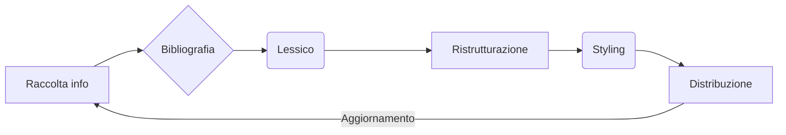

{width=100px height=100px}

# Guida per genitori sulla DSA
Come accompagnare un ragazzo nel suo percorso di crescità

## Introduzione

Il progetto verte a produrre una guida destinata a genitori/tutori di ragazzi con DSA, con lo scopo di informarli sulla condizione
del proprio figlio e di fornirgli tutte le risorse necessarie per la sua crescita, comunicando le possibili tecniche di affiancamento,
i servizi forniti da enti a supporto della loro condizione e, in generale, come accompagnare il proprio figlio nel migliore dei modi in
base al suo disturbo.

Il prodotto quindi deve essere distribuito come e-Book tramite i principali store online compatibili con e-Reader, smartphone e tablet più
diffusi. 

## Ideazione

### Tema
Il prodotto dovrà informare i genitori sulle varie sfaccettature della DSA e come affrontarla. Il contenuto non dovrà essere di tipo
scientifico e freddo, ma dovrà risultare piacevole e di conforto.

\

Le principali domande a cui si deve rispondere possono essere legate a:

+ relazione scuola - ragazzo, come rendergli leggera la vita a scuola e affrontarla con postività
+ accettazione di se stessi e delle proprie caratteristiche
+ come affrontare e supportare il proprio figlio in situazioni di bullismo
+ come lo stato o altri enti supportano le famiglie

Quindi il prodotto dovrà si introdurre il lettore a questi temi e rispondere ad alcune domande, ma dovrà anche mettere a disposizione dei
mezzi di approfondimento più specifici, magari rimandando a fonti esterne se l'approfondimento è di carattere altamente professionale e
specifico.

Essendo una guida, il prodotto verrà principalmente consultato nel dettaglio poche volte, ma dovrà essere in grado di riproporre informazioni
specifiche (come informazioni, procedure, contenuti esterni tramite link) in maniera veloce al bisogno, attraverso una buona struttura
della tabella dei contenuti (TOC)

### Destinatari
I destinatari saranno principalmente famiglie che si sono appena trovate in questa realtà, potrebbero presentare perciò una gran quantità di
dubbi, incertezze e preoccupazioni, potrebbero notare nel figlio una mancanza di fiducia in se stessi, di opportunità.
È quindi fondamentale essere rapidi, comunicativi e non freddi nella comunicazione, per evitare di aggravare sulla potenziale situazione
sentimentale.

### Modello di fruizione
Il prodotto dovrà essere sempre disponibile all'occorrenza per una consultazione, quindi accessibile da uno smartphone, ma in quanto il suo iniziale modello di fruizione sarà principalmente una lettura sequenziale delle informazioni desiderate, dovrà essere compatibile con tablet
ed e-Reader.

Per questi motivi lo standard di riferimento è quello degli eBook, in particolare attraverso il formato ePub, ottimale per la iniziale lettura
sequenziale, per la gestione automatica delle applicazioni di lettura dei "segnalibro" e per la generale diffusione di strumenti come indici
generati dalla tabella dei contenuti e "bookmarks" per tenere traccia di informazioni considerate importanti.

### Canali di distribuzione
I canali di distribuzione saranno i principali store di eBook (Amazon Kindle, Apple Books, Google Play Books, Kobo): tutti questi store
supportano direttamente, o tramite una auto-conversione effettuata dalla piattaforma di caricamento (Kindle direct publishing), il formato
ePub. [@noauthor_quali_nodate] [@noauthor_book_nodate] [@noauthor_apple_2024] [@noauthor_file_nodate]

Per accentuale la percezione di sensibilità verso l'argomento e per ridurre la pesantezza della lettura al minimo, c'è il bisogno di utilizzare
uno stile colorato, vivace, un font facile e poco squadrato e regolare, uno stile artistico per le illustrazioni poco realistico. In generale
lo stile dovrà essere orientato più verso un'espressione informale. Per questo il font utilizzato è l'OpenDyslexic.

Non ci sono standard importi nel mercato per questo tipo di argomenti che vanno oltre ciò descritto sopra.

## Processo di Produzione

### Acquisizione dei contenuti
Il processo di acquisizione delle fonti è principalmente suddiviso in 3 parti:

+ ricerca di tutti i contenuti, informazioni, risposte e risorse necessarie per soddisfare le richieste e obiettivi descritti sopra.
  Questo processo è principalmente manuale, in quanto non sono disponibili online fonti aperte. ([@org_aiditalia AID Italia])
+ riadattamento del linguaggio utilizzato nelle fonti per rendere il contenuto più facile, rapido, chiaro e incisivo, quindi rimandare alle
  fonti originali per più informazioni dettagliate. Questo processo può essere effettuato sia manualmente che in modo automatico tramite
  strumenti basati su intelligenza artificiale.
+ realizzazione delle illustrazioni inerenti allo stile grafico, anch'esse realizzabili sia manualmente da un illustratore che in maniera
  automatica da intelligenze artificiali

### Gestione documentale
Il flusso è abbastanza ciclico:

+ raccolta dei contenuti / ricerca di aggiornamenti
+ utilizzo di strumenti, come Zotero, per l'estrazione di risorse e la gestione della bibliografia
+ modifica del contenuto per aderire allo stile lessicale
+ stesura dei contenuti in modo che gli indici abbiamo importanza e siano efficaci nella navigazione del prodotto; i contenuti sono divisi in
  file e potenzialmente in più cartelle e sottocartelle: l'utilizzo di indici prefissati ai loro nomi (`00_nome_file.md`) permette di avere
  una struttura di file nel progetto che rispecchi la struttura dei contenuti, e rende facile la riorganizzazione del contenuto
+ aggiunta di elementi stilistici e fonti esterne per catturare l'attenzione.
+ la distribuzione va effettuata manualmente per ogni store su cui si vuole pubblicare il prodotto

### Tecnologie adottate

|                |Scenario 1                          |Scenario 2                   |
|----------------|------------------------------------|-----------------------------|
|Markdown |Usato per la rappresentazione dei contenuti |Organizzazione delle gerarchie dei contenuti |
|ePud |Distribuzione con un'unico formato su tutti i principali store | |
|Zotero |Raccolta e gestione della bibliografia | |
|Bash |Per script di build con preparazione della gerarchia dei contenuti | |
|AI Generativa |Per la realizzazione di illustrazioni tematizzate |Adattamento delle fonti al registro stilistico del prodotto |

### Esecuzione del flusso
[Repository del Progetto](https://github.com/nixpare/progetto-editoria-digitale)

## Valutazione dei risultati raggiunti
La gestione documentale ha un buon risultato grazie all'utilizzo di tecnologie come Zotero e Git, soprattutto grazie alla divisione dei contenuti
da una struttura gerarchica composta da file e cartelle, questo permette di lavorare più facilmente su più tipi di contenuti in comtemporanea e
rendere il merging delle versioni finali più lineare.

L'acquisizione dei contenuti è la parte più carente, data dalla mancanza di una fonte libera online, ma non dovrebbe essere un problema in quanto i temi descritti in generale sono ormai consolidati. Si potrebbe aggiungere al progetto una componente di scripting (attraverso degli script python e l'uso della libreria BeautifulSoup) per aggiornare in automatico eventuali link per portali o risorse che potrebbero essere aggiornati.

### Valutazione del flusso di produzione

Si potrebbe facilmente realizzare un sito web con gli stessi contenuti, magari strutturato come un manuale con indice, per allargare la sua
fruizione a dispositivi come i computer, magari attraverso l'utilizzo di strumenti come MkDocs.

### Limiti emersi

La limitazione più grande è stata l'impossibilità di reperire i contenuti in modo automatico.

## Conclusioni

Discutere i risultati ottenuti, verificando se gli obiettivi definiti dai casi d'uso siano pienamente o parzialmente raggiunti. Evidenziare gli aspetti nei quali si sono raggiunti i risultati più soddisfacenti e le limitazioni emerse.

## Bibliografia e sitografia

[@ceravolo2023 Lezioni di Editoria Digitale]

[@ceravolo2024 Esercizi di Editoria Digitale]

[@ceravolo2023_coll Dispense di Editoria Digitale]

---
